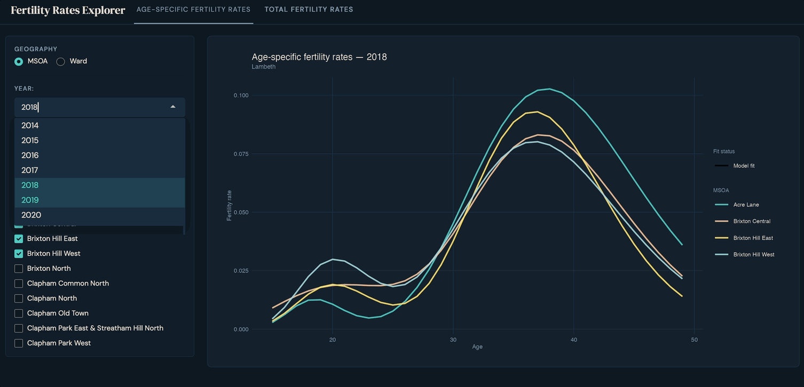

# Small Area Births

This is a project developed while I worked at the Greater London Authority (GLA).

## Introduction

Fertility rates are a key component of population estimates and projections. It represents, in combination with mortality rates, the natural change in populations. Age-specific fertility estimates are used to project future fertility rates and births, serving as inputs to the GLA's annual population projections. 

This project develops fertility estimates for small geographic areas (e.g. MSOAs, wards), enabling the GLA Demography Team to produce flexible outputs for bespoke geographies.

## Getting started

To avoid path issues, open the R project `small-area-births.Rproj`.

Packages and dependencies are managed via `pak` ([see package documentation](https://pak.r-lib.org/index.html)). The `dev-init.R` script creates the lockfile and install required packages.

Currently there are 2 scripts:

1. `R/msoa_fertility_rates.R` 
2. `R/ward_fertility_rates.R`

Run `R/msoa_fertility_rates.R` to download the raw data and apply the Iterative Proportional Fitting algorithm across all geographies and years. After that you may run `R/ward_fertility_rates.R` to get births by wards (2022 boundaries).

## Exploring the results

To interactively explore outputs (ASFR and TFR by MSOA and ward), run `app/app.R`

## Technical notes and methodology

Birth data by age of mother at the MSOA level is only available in five-year age bands, but the GLA's population models require estimates by single year of age. This project uses Iterative Proportional Fitting to disaggregate the data into single-year age groups, using mid-year births by age of mother at the local authority level.

[Iterative Proportional Fitting (IPF)](https://spatial-microsim-book.robinlovelace.net/nomicrodata) is an algorithm that adjusts a dataset based on marginal constraints. The initial 'seed' is set by the mid-year population estimates by MSOA, and the row and column constraints for each age band are set as MSOA and local authorities totals, respectively.

*Please note that due to small numbers City of London and Isles of Scilly wards have been aggregated to Local Authority levels.

## Requirements

#### Nomis API 

We use the `nomisr` package to download ONS MSOA population estimates from Nomis. To download all the necessary data you'll need an Nomis account. Guest users are only allowed to download 350,000 rows, while registered users can send requests of up 1,500,000 rows.

1. Register for a free [Nomis account](https://www.nomisweb.co.uk/myaccount/userjoin.asp)
2. Go to `home > My Account > Nomis API` and copy your API Key under 'Your Unique ID'
3. Add `NOMIS_API_KEY="Nomis API key"` to your `.Renviron` file

#### Dependencies

Package dependecies should be installed from the `dev-init.R` file.

## Data
### Source data

All data used in this project is publicly available:

- ONS mid-year births by age of mother (single-year) and local authority, England and Wales (1992 - 2021).
- ONS mid-year births by age of mother (five-year age bands) and MSOAs, England and Wales (2001 - 2021)
- ONS mid-year births by Census Output Areas, England and Wales (2022 - 2024)
- ONS mid-year population estimates by MSOA (2011 - 2024)
- House of Commons MSOA names lookup
- Various ONS lookups from the Open Geography Portal API

### Final output

#### MSOA fertility rates from `R/msoa_fertility_rates.R`

The output of the IPF function contains births, population at risk and age-specific fertility rates.

We then calculate rolling sums and apply the smoothing function to get a timeseries with fertility rates by age of mother and total fertility rates by MSOA.

###### ------------- **Age-specific fertility rates** -------------

| Field            | Description                                                                 |
|------------------|-----------------------------------------------------------------------------|
| age              | Age of mother (15 to 49 years)                                             |
| msoa21_code      | Middle Layer Super Output Area (MSOA) 2021 code                            |
| msoa21_name      | Middle Layer Super Output Area (MSOA) 2021 name                            |
| gss_code         | Local authority district code                                              |
| gss_name         | Local authority name                                                       |
| label_year       | Labelled time period for smoothing window (e.g., 2012–2014)                |
| year             | Central calendar year of the labelled period                               |
| fertility_rate   | Estimated (smoothed) fertility rate                                        |
| fitting_status   | Status of model fitting (e.g., succeeded or failed)                        |

###### ------------- **Total fertility rates** -------------

| Field            | Description                                                                 |
|------------------|-----------------------------------------------------------------------------|
| msoa21_code      | Middle Layer Super Output Area (MSOA) 2021 code                            |
| msoa21_name      | Middle Layer Super Output Area (MSOA) 2021 name                            |
| gss_code         | Local authority district code                                              |
| gss_name         | Local authority name                                                       |
| year             | Central calendar year of the labelled period                               |
| tfr              | Total fertility rates                                                      |

#### Ward fertility rates from `R/ward_fertility_rates.R`

Ward fertility rates are created from the latest year of MSOA age-specific fertility rates weigted by OA total births, averaged across 2022, 2023 and 2024.

Because of the lack of available timeseries data, the fertility rates by ward is a approximation of current levels of fertility.

###### ------------- **Age-specific fertility rates** -------------

| Field            | Description                                                                 |
|------------------|-----------------------------------------------------------------------------|
| age              | Age of mother (15 to 49 years)                                             |
| wd22cd           | Ward code                                                                  |
| wd22nm           | Ward name                                                                  |
| gss_code         | Local authority district code                                              |
| gss_name         | Local authority name                                                       |
| fertility_rate   | Estimated (smoothed) fertility rate                                        |

###### ------------- **Total fertility rates** -------------

| Field            | Description                                                                 |
|------------------|-----------------------------------------------------------------------------|
| msoa21_code      | Middle Layer Super Output Area (MSOA) 2021 code                            |
| msoa21_name      | Middle Layer Super Output Area (MSOA) 2021 name                            |
| gss_code         | Local authority district code                                              |
| gss_name         | Local authority name                                                       |
| tfr              | Total fertility rates                                                      |

## Authors

* Izabel Bahia
* Ben Corr (Greater London Authority)

## Contact

If you have any questions or would like to raise an issue you can email the Demography team (demography@london.gov.uk).

